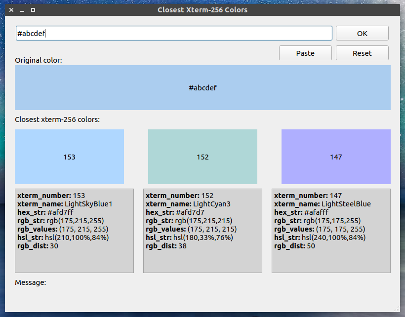

Closest X11 Color
=================

Find the closest X11 color (between 0 and 255) to an HTML hexa color (e.g. #ABCDEF).

Motivation
----------

Under Linux, in a terminal, you can use 16 colors. However, most terminals
support 256 different colors. You want to write a console application that
uses some nice colors. If you find it difficult to pick colors from the
256 colors, then this GUI app. is for you.

How to use it? Let's say you find a nice color on an image. Open it in
Gimp and use its color picker tool to identify the color. However, Gimp
will tell you the color's HTML hexa code, e.g. #ABCDEF. With this app. you can
find the closest color from the 256 X11 colors, and then you can immediately
use that color in your console application.

Screenshots
-----------

  

  

Links
-----

Color data is from [https://jonasjacek.github.io/colors/](https://jonasjacek.github.io/colors/).
